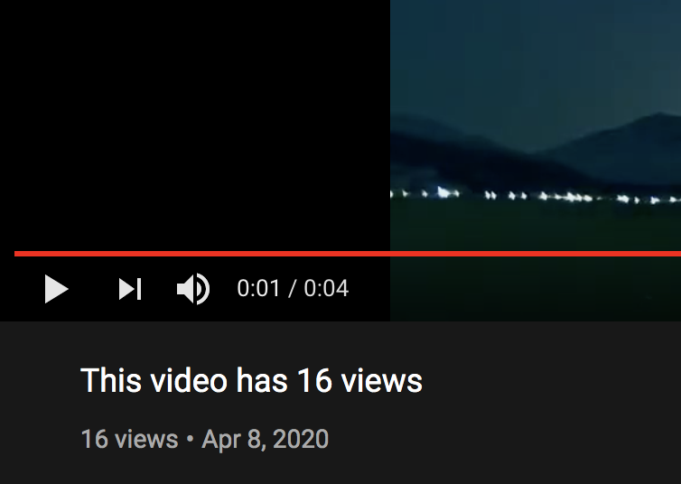

# This video has "X" views

> A YouTube bot that will update the video title to match the view count



This code was inspired by a [Tweet](https://twitter.com/tomscott/status/1247178247437078529) by Tom Scott that referenced a YouTube video who’s title seemed to automagically match the view count. This is a Node.js example of how to do this.

Here’s the original YouTube video: [https://www.youtube.com/watch?v=BxV14h0kFs0](https://www.youtube.com/watch?v=BxV14h0kFs0)

And here’s my copy: [https://www.youtube.com/watch?v=17uGdxLtas0](https://www.youtube.com/watch?v=17uGdxLtas0)

## Project Setup

### Clone the repo locally

```bash
git clone https://github.com/stursby/this-video-has-x-views.git && cd this-video-has-x-views
```

### Install the dependencies (via Yarn, or npm)

```
yarn
# npm install
```

## Setup YouTube API

A lof of the code is copied over from [https://developers.google.com/youtube/v3/quickstart/nodejs](https://developers.google.com/youtube/v3/quickstart/nodejs)

#### 1. Log into the Google Developers Console:

https://console.developers.google.com/

#### 2. Create New Project

On the right side you should see a button to create a new project.

I'll name mine "This video has x views"

Next, click **"Create"**.

#### 3. Enable the YouTube Data API v3

Click the **"Enable APIs and Services"** button

Search for **"YouTube"** and then enable the **"YouTube Data API v3"**

#### 4. Generate Credentials

Click the **"Create Credentails"** button and the select the following:

_Which API are you using?_

- YouTube Data API v3

_Where will you be calling the API from?_

- Other UI (eg: Windows, CLI tool)

_What data will you be accessing?_

- User data

#### 5. Set up consent screen

Select **"External"** for the User Type

Fill out your Application Name, then hit **"Save"** at the very bottom

Rename the file `client_id.json`

## Run the bot

`node bot.js`

If this is the first time running the bot, it you'll be prompted in the CLI to visit a Google URL which walks you through the OAuth flow.

Once you accept all the app permissions, you'll be give a code. Enter that back into your CLI.

If successful, your video title was just updated!
